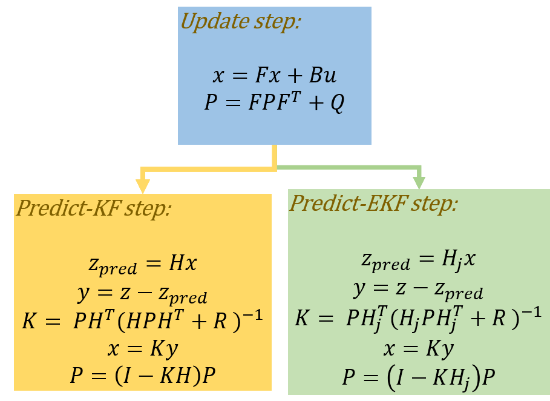
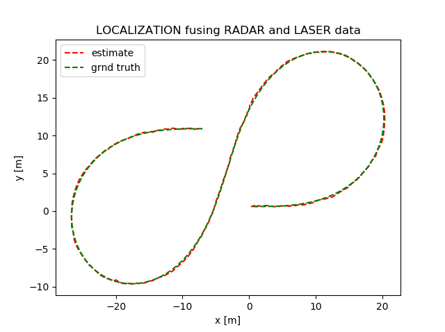

# Localize-Fusing-Radar-Laser
Fuse measurement data from RADAR and LASER to localize


In this project, location of a moving car is localized fusing RADAR and LASER data. In reality, the radar and laser sensor are fixed on top of the moving car so that we get updated measurement from these sensors as the car moves around. In this project the sensor data are given in a text file, located in `data/obj_pose-laser-radar-synthetic-input.txt`. The data looks as follows,
```
L	3.122427e-01	5.803398e-01	1477010443000000	6.000000e-01	6.000000e-01	5.199937e+00	0	0	6.911322e-03
R	1.014892e+00	5.543292e-01	4.892807e+00	1477010443050000	8.599968e-01	6.000449e-01	5.199747e+00	1.796856e-03	3.455661e-04	1.382155e-02
```
The letter `L` describes all the following values in that row pertaining to the LASER data whereas `R` stands for RADAR. The data are labeled as,
```
L meas_px meas_py tm gt_px gt_py gt_vx gt_vy
R meas_rho meas_phi meas_rho_dot timestamp gt_px gt_py gt_vx gt_vy
```

The key steps in achieving robust localization fusing sensor data are as follows,
1. Get the measurement information, either from RADAR or LASER by reading one row at a time from the data file.
2. Now we will know the measured location of the car along with the time-step value.
3. Assuming the observer model of the car is linear, we predict car location with respect to time-step value.
4. The measurement update is done using Kalman Filter (KF) or Extended Kalman Filter (EKF) depending on the current measurement is from LASER or RADAR. Since the measurement equation of the RADAR is non-linear we need to use EKF for the update step.

The relevant equations used for prediction and steps are show in the figure below,
.

The output is shown in animation in the top figure where blue and red triangles denote noisy measurements of the car obtained from the RADAR and LASER respectively. The estimated pose obtained by fusing these two sensor information using EKF is shown as green dots. Finally estimated path is compared with ground truth data in the figure below.

